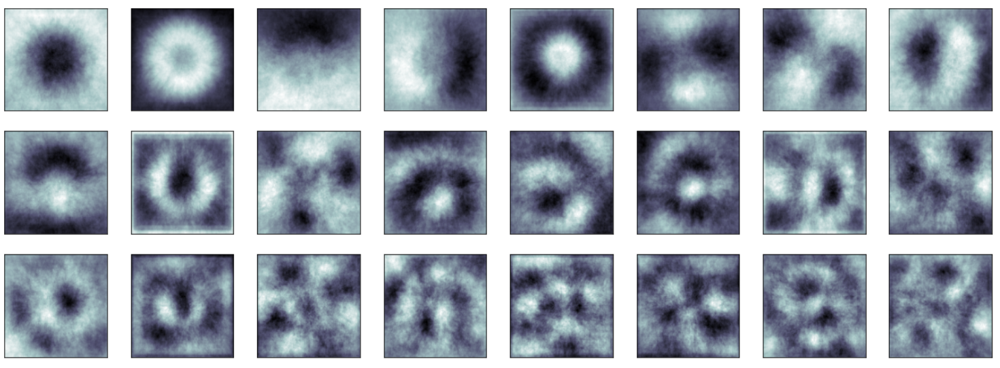
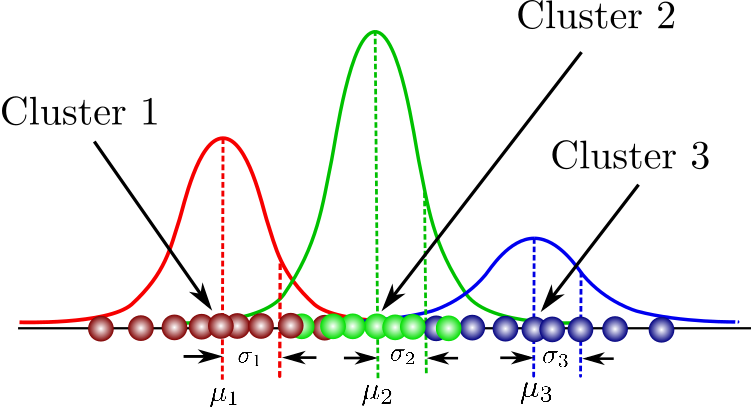
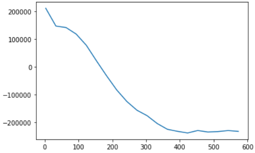

# **Gaussian Mixture Model for Image Data Generation**
## Project Specification
The project is based on the use of Gaussian Mixture Model for Image Data Augmentation by generating new images from the flower image Dataset.

## DataSet
Dataset for this project is taken from [Harvard Dataset](https://dataverse.harvard.edu/file.xhtml?fileId=4105627&version=8.0). Which contains thousands of flowers Images. Around 800 images sample is used from the dataset.

                        
                        

 

# *Methedology*

## **1. Computation Cost Reduction: 'Principal Component Analysis'**
To optimize computation time, grayscale images of size 128x128 pixels are used. Before utilizing a 128x128 figure, it needs to be transformed into a feature vector with a length of 16384.

I have used Principal Component Analysis(PCA) to reduce the number of dimensions of the data. 
 
* PCA identifies patterns by analyzing feature correlations and captures high-dimensional data's maximum variance.
* It projects the data onto a lower-dimensional subspace while preserving essential information. 

I considered 99 perent of the variance, hence there will be very little information loss. 
### ***Results***
After applying PCA, the dimentions are tranformed from 16384(128x128) to 588. 

Here PCA recognised 588 features through out the data set. Some of them are shown below.

 

## **2. Gaussian Mixture Model: Training and Data Generation**

* Gaussian mixture models (GMMs) assume data points are generated from a mixture of Gaussian distributions, and training them with a dataset helps find suitable parameters.
* By selecting a specific cluster and utilizing its parameters, GMMs can generate samples associated with that cluster.

**Number of Clusters:**
 
The number of clusters for a well-converged GMM model was determined using the 'Akaike Information Criteria' (AIC).

The AIC suggested approximately 410 clusters, ensuring significant convergence of the model.

 

## **Generated Images**

                        
                        

We can see most of the generated Data look plausible flower images.
